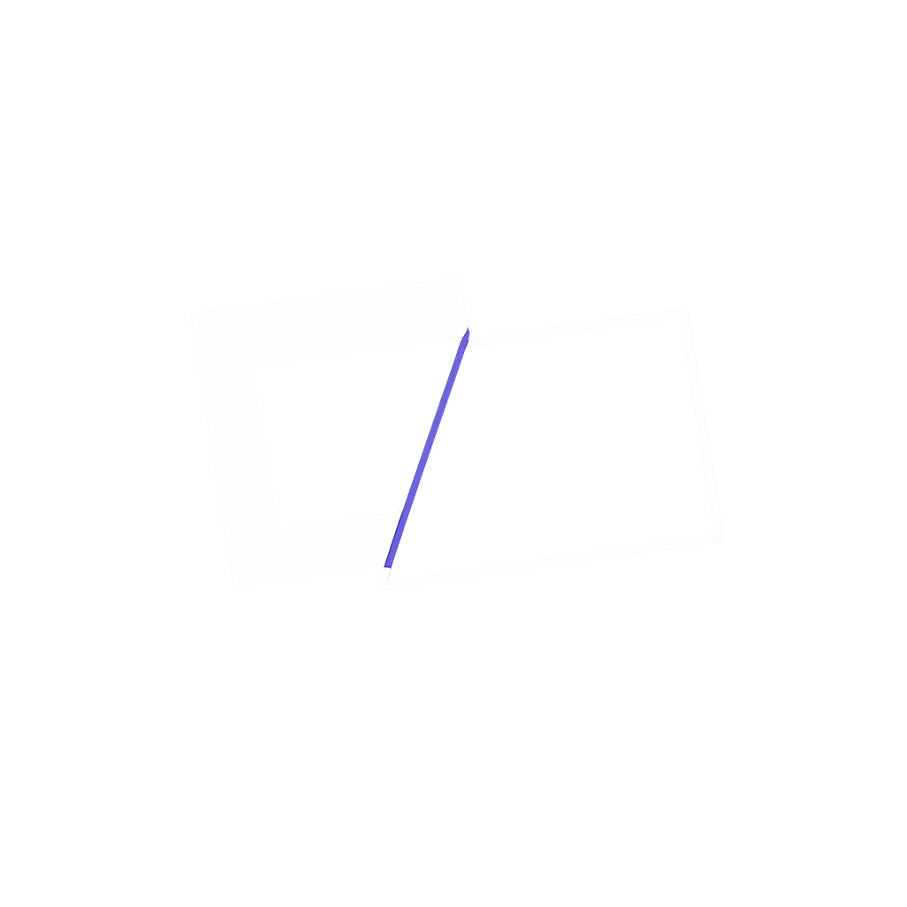

<div align="center">
  
  <h1>Clypra Studio</h1>
  <p><strong>AI-Powered Text Effects & Creative Editor</strong></p>
  <p>Design, animate, and export high-performance Canvas 2D text effects with gradients, bevels, glow stacks, shadows, and procedural engines.</p>
  
  <a href="https://clypra.abdulkabirmusa.com">Live Demo</a> • 
  <a href="https://clypra.abdulkabirmusa.com/studio">Studio App</a>
</div>

---

## ✨ Features

### 🎨 **Design Studio**

- **Real-time Canvas Preview** - Instant visual feedback as you design
- **Advanced Typography Controls** - Font family, size, weight, letter spacing, and line height
- **Multi-layer Effects** - Gradients, shadows, glows, bevels, and strokes
- **Color Management** - Full RGBA color picker with gradient support
- **Preset Library** - 20+ built-in professional presets
- **Custom Presets** - Save and manage your own effect templates

### 🤖 **AI-Powered Tools**

- **Prompt-to-Style** - Generate text effects from natural language descriptions
- **Image Style Scanner** - Analyze and replicate text effects from images
- **AI Name Generator** - Smart naming for your custom effects
- **Deep Design Research** - Historical and thematic style exploration

### 🎬 **Animation Engine**

- **Timeline Editor** - Professional keyframe-based animation
- **Layer System** - Organize and animate multiple text layers
- **Easing Functions** - Smooth transitions with customizable curves
- **Export Options** - PNG, PNG sequence, and WebM video formats

### 💻 **Developer Export**

- **TypeScript/JavaScript** - Production-ready code generation
- **Standalone HTML** - Self-contained interactive demos
- **JSON Definitions** - Portable effect configurations
- **Copy & Download** - Quick integration into your projects

---

## 🚀 Getting Started

### Prerequisites

- **Node.js** (v16 or higher)
- **npm** or **yarn**
- **Gemini API Key** (for AI features)

### Installation

1. **Clone the repository**

   ```bash
   git clone https://github.com/AIEraDev/clypra-studio.git
   cd clypra-studio
   ```

2. **Install dependencies**

   ```bash
   npm install
   ```

3. **Set up environment variables**

   Create a `.env.local` file in the root directory:

   ```env
   GEMINI_API_KEY=your_gemini_api_key_here
   ```

   Get your API key from [Google AI Studio](https://ai.google.dev/)

4. **Run the development server**

   ```bash
   npm run dev
   ```

5. **Open your browser**

   Navigate to `http://localhost:5173`

---

## 📦 Build & Deploy

### Build for Production

```bash
npm run build
```

### Preview Production Build

```bash
npm run preview
```

### Deploy to Vercel

```bash
vercel deploy
```

---

## 🛠️ Tech Stack

- **Frontend Framework** - React 18 + TypeScript
- **Build Tool** - Vite
- **Styling** - Tailwind CSS + Custom CSS Variables
- **Canvas Rendering** - HTML5 Canvas 2D API
- **AI Integration** - Google Gemini API
- **Animation** - Custom keyframe engine
- **Export** - Canvas-to-PNG, WebM encoding
- **Routing** - Client-side routing with route-based metadata
- **Testing** - Vitest

---

## 📁 Project Structure

```
clypra-studio/
├── public/              # Static assets (logos, images, manifests)
├── src/
│   ├── components/      # React components
│   │   ├── screens/     # Page components (WebShowcase, etc.)
│   │   ├── *.tsx        # UI components (panels, modals, controls)
│   ├── engine/          # Core text effect engine
│   │   ├── animation.ts # Animation system
│   │   ├── render.ts    # Canvas rendering
│   │   ├── schema.ts    # Type definitions
│   │   └── *.ts         # Engine utilities
│   ├── hooks/           # Custom React hooks
│   ├── App.tsx          # Main studio application
│   ├── RootApp.tsx      # Root component with routing
│   ├── main.tsx         # Application entry point
│   ├── presets.ts       # Built-in effect presets
│   └── types.ts         # TypeScript type definitions
├── api/                 # Server-side API handlers
│   ├── handlers.ts      # Gemini API integration
│   └── index.ts         # API routes
├── server.ts            # Express server
└── package.json         # Dependencies and scripts
```

---

## 🎯 Usage

### Creating a Text Effect

1. **Start from a preset** or create from scratch
2. **Customize typography** - Font, size, spacing
3. **Add effects** - Gradients, shadows, glows, bevels
4. **Animate** (optional) - Add keyframes and transitions
5. **Export** - Download as code, image, or video

### Using AI Features

#### Prompt-to-Style

```
"Create a retro 80s neon effect with pink and cyan colors"
```

#### Image Scanner

Upload an image with text effects, and the AI will analyze and recreate the styling.

### Exporting Code

The studio generates production-ready code:

- **TypeScript Class** - Reusable effect engine
- **HTML Sandbox** - Standalone interactive demo
- **JSON Config** - Portable effect definition

---

## 🤝 Contributing

Contributions are welcome! Please feel free to submit a Pull Request.

1. Fork the repository
2. Create your feature branch (`git checkout -b feature/amazing-feature`)
3. Commit your changes (`git commit -m 'feat: add amazing feature'`)
4. Push to the branch (`git push origin feature/amazing-feature`)
5. Open a Pull Request

---

## 📄 License

This project is licensed under the MIT License - see the [LICENSE](LICENSE) file for details.

---

## 🙏 Acknowledgments

- **Google Gemini** - AI-powered design assistance
- **React Team** - Amazing frontend framework
- **Vite** - Lightning-fast build tool
- **Tailwind CSS** - Utility-first CSS framework

---

## 📧 Contact

**Abdul Kabir Musa**

- Website: [clypra.abdulkabirmusa.com](https://abdulkabirmusa.com)
- GitHub: [@AIEraDev](https://github.com/AIEraDev)

---

<div align="center">
  <p>Made with ❤️ by AbdulKabir Musa</p>
  <p>⭐ Star this repo if you find it useful!</p>
</div>
